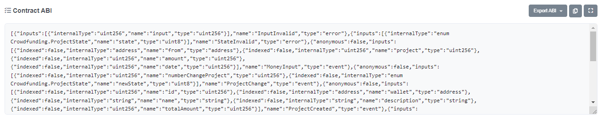

# web3-tx

Interactuar con un contrato inteligente paso a paso para principiantes sin necesidad de ninguna web.

## Uso

### Antes de nada

Descarga este repositorio desde la pestaña _Code_ → _Download Zip_.

Una vez descargado, tienes que descomprimir el _zip_ descargado y quedarte con la carpeta _web3-tx_ y todos sus archivos.

#### Árbol
web3-tx
|
|- ./images
|- ./node_modules
|- .env
|- LICENSE
|- README.md
|- interact.js
|- package-lock.json
|- package.json

**IMPORTANTE! - Este proyecto está diseñado para que se descarguen todos los archivos necesarios y no se dependa de descargar absolutamente nada de ningún otro repositorio.**

**Si quieres actualizar las librerías simplemente borra las líneas 20-24 asociadas a las dependencias en el archivo `package.json`, el archivo `package-lock.json` y la carpeta `node_modules`. Abre una consola nueva y escribe `npm install`**

### NodeJS

Para ejecutar este proyecto necesitas tener instalado NodeJS: https://nodejs.org/es/

### .env

En el archivo `.env` hay 6 datos a rellenar:

- **RPC** : La URL del RPC con el que se va a interactuar.
Ejemplo: `RPC = "https://X-rpc.gateway.X.network"`
Lista de RPCs Públicos recomendada: https://github.com/arddluma/awesome-list-rpc-nodes-providers

- **MY_ADDRESS** : La address del emisor, es decir, tu address.
Ejemplo: `MY_ADDRESS = "0x0000000000000000000000000000000000000000"`

- **PK** : Clave privada asociadad a la address anterior.
Ejemplo: `PK = "0000000000000000000000000000000000000000000000000000000000000000"`

- **CHAIN_ID** : ID de la cadena a utilizar.
Ejemplo: `CHAIN_ID = 5`

  | Nombre|ID|
  |:-----:|:--:|
  | Mainnet |1|
  | Rinkeby |4|
  | Goerli |5|
  | Ropsten |3|
  | Kovan |42|
  | Sepolia |11155111|

- **CONTRACT_ADDRESS** : Address del contrato con el que vas a interactuar.
Ejemplo: `CONTRACT_ADDRESS = "0x0000000000000000000000000000000000000001"`

- **ABI** : ABI del contrato con el que vas a interactuar.
Ejemplo: `ABI = [{"inputs":[{"internalType":"uint256","name":"input","type":"uint256"}]...`
El ABI de un contrato se encuentra en el scan asociado a la red del contrato con el que vas a interactuar.

  

Una vez se muestre ese apartado, bajas hasta donde pone _Contract ABI_

  

  

Se copia y se pega en el apartado `.env → ABI`

### interact.js

Este es el archivo más importante, contiene el código para lanzar la transacción.

### Función a ejecutar

En la línea 41, hay una llamada a un método del contrato. Para usarlo debes escribir el nombre de la función a ejecutar.

`data: contract.methods.X().encodeABI()`

Sustituir `X` por la función a ejecutar.

Ejemplo:
`data: contract.methods.createProject('Proyecto1', 'Descripcion1', 1000000000000000).encodeABI()`

  

Como ves, se escriben los datos necesarios en el formato adecuado.

## Ejecución

### Abrir la consola de comandos

- Windows: Shift + botón derecho en la carpeta → Abrir Powershell
- Linux y MacOS: Busca Terminal y posicionate en la carpeta de web3-tx 

Por último, escribe y ejecuta:

`node interact.js`

La transacción entrará a la mempool de la blockchain y aparecerá el hash de la transacción para que puedas buscarlo en el scan correspondiente.
Si todo funciona correctamente, aparecerá en la pantalla el mensaje "Transacción minada!" junto a sus datos.

## Fallos

Si te aparece cualquier error, puedes hablarme por Telegram y estaré encantado de ayudar: [@Ivanovish10](https://t.me/ivanovish10)