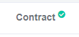
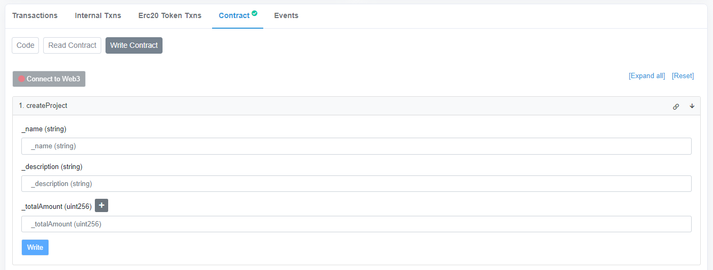

# web3-tx

Interactuar con un contrato inteligente sin necesidad de ninguna web.

## Uso

### NodeJS

Para ejecutar este proyecto necesitas tener instalado NodeJS: https://nodejs.org/es/

### .env

En el archivo `.env` hay 6 datos a rellenar:

- **RPC** : La URL del RPC con el que se va a interactuar.
Ejemplo: `RPC = "https://eth-rpc.gateway.X.network"`
Lista de RPCs Públicos recomendada: https://github.com/arddluma/awesome-list-rpc-nodes-providers#fantom

- **MY_ADDRESS** : La address del emisor, es decir, tu address.
Ejemplo: `MY_ADDRESS = "0x0000000000000000000000000000000000000000"`

- **PK** : Clave privada asociadad a la address anterior.
Ejemplo: `PK = "0000000000000000000000000000000000000000000000000000000000000000"`

- **CHAIN** : Cadena a utilizar.
Ejemplo: `CHAIN = "ropsten"`

  | Nombre|
  |:-----:|
  | mainnet |
  | rinkeby |
  | goerli |
  | ropsten |

- **CONTRACT_ADDRESS** : Address del contrato con el que vas a interactuar.
Ejemplo: `CONTRACT_ADDRESS = "0x0000000000000000000000000000000000000001"`

- **ABI** : ABI del contrato con el que vas a interactuar.
Ejemplo: `ABI = [{"inputs":[{"internalType":"uint256","name":"input","type":"uint256"}]...`
El ABI de un contrato se encuentra en el scan asociado a la red del contrato con el que vas a interactuar.

  
Una vez se muestre ese apartado, bajas hasta donde pone _Contract ABI_
  
  
Se copia y se pega en el apartado `.env -> ABI`

### interact.js

Este es el archivo más importante, contiene el código para lanzar la transacción.

### Función a ejecutar

En la línea 22, hay una llamada a un método del contrato. Para usarlo debes escribir el nombre de la función a ejecutar.

`data: contract.methods.X().encodeABI()`

Sustituir `X` por la función a ejecutar.

Ejemplo:
`data: contract.methods.createProject('Proyecto1', 'Descripcion1', 1000000000000000).encodeABI()`

  

Como ves, se escriben los datos necesarios en el formato adecuado.

## Ejecución

Después de configurar todo, simplemente ejecuta en tu terminal (buscar cmd en Windows, Terminal en Linux y MacOS)

`node interact.js`

Si se ejecuta correctamente la transacción, aparecerá en la pantalla una transacción completada junto a sus datos. Entre ellos aparece transactionHash. Si la copias y la pegas en el scan correspondiente, podrás ver tu transacción completada.

## Fallos

Si te aparece cualquier error, puedes hablarme por Telegram y estaré encantado de ayudar: [@Ivanovish10](https://t.me/ivanovish10)